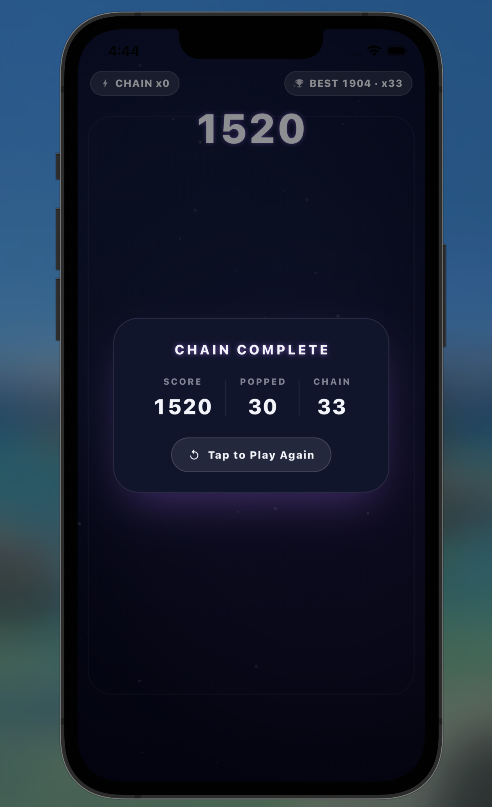

# Day 39 — Bubble Chain

A polished mobile mini-game built in Flutter/Dart. Tap one bubble to detonate it and let the expanding energy waves ripple outward, popping every bubble they touch — each new pop spawns its own wave and the chain reaction runs on real physics.

## Preview

  

## Features

- Real chain reaction — every wave grows over time and pops any idle bubble whose disc it touches, which spawns a new wave in turn
- Poisson-ish bubble spawn (28-34 bubbles, mixed sizes / 5 hero colours, soft drift + wall bounce)
- Bubble state machine: `idle → popping → popped` with a 1 → 1.15 → 0.85 → burst scale animation
- Glossy bubble render: radial gradient + bright rim + double specular highlight + wide glow
- 3-layer expanding wave (glow / body / bright inner line) with real distance-based collision
- Chain-aware scoring — bubble N gives N points, multiplied ×2 at chain 10, ×3 at 15, ×4 at 20+
- Floating "INCREDIBLE!" tag + subtle screen shake at chain 20
- Best score + best chain persisted with `SharedPreferences`
- Round-end detection when no waves are live and no bubbles are still popping
- iOS-only project (portrait, Impeller)
